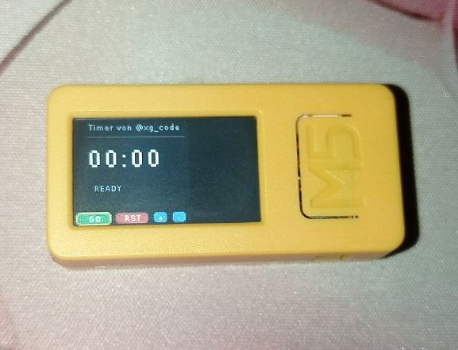
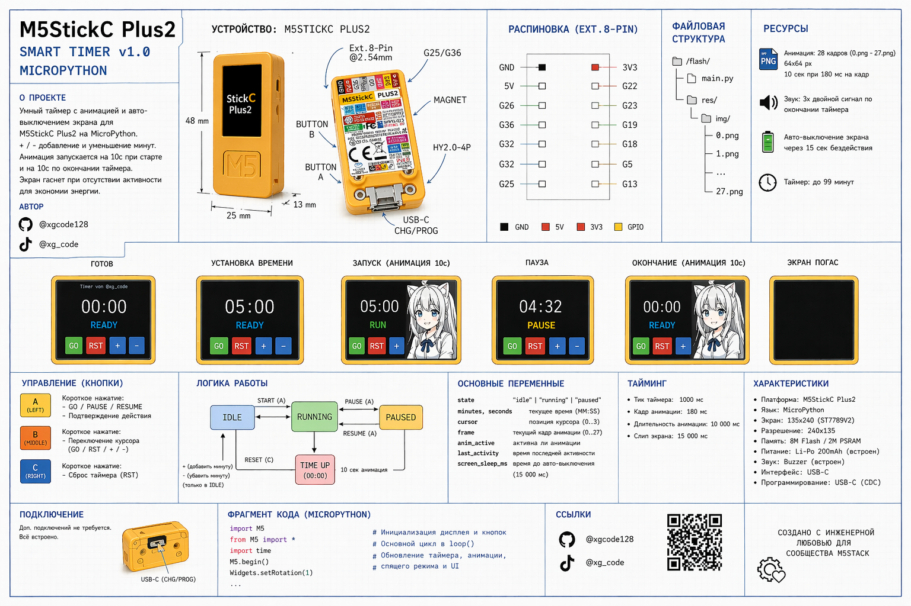

## 🚀 How to Use

### 1. Upload the code
Upload `m5stack_anime_timer.py` to your M5Stack device using UIFlow or MicroPython.

### 2. Add animation frames
Place your animation images into the device:

/flash/res/img/

Required format:
0.png
1.png
2.png
...
26.png

### 3. Run the project
Start the script on your device.

---

## 🎮 Controls

- Btn A → Select / Action  
- Btn B → Switch between buttons  
- Btn C → Reset timer  

---

## ⏱️ Timer Logic

- Use + / - to set minutes  
- Press GO to start  
- Press again to pause  
- Timer counts down to zero  

---

## 🎌 Animation

- Starts when timer begins  
- Plays for ~10 seconds  
- Appears again when timer ends  

---

## 🔋 Power Saving

- Screen turns off after inactivity  
- Any button press wakes it up  

---

## 🧠 Notes

- Works on M5StickC Plus2 / Core2  
- Written in MicroPython (UIFlow)  
- You can replace animation frames with your own  

---

## 🛠️ Customization

You can easily modify:
- Animation frames  
- Colors and UI  
- Timer logic  
- Add Wi-Fi features  

---

## 📸 Example

---

## 🎬 Demo

